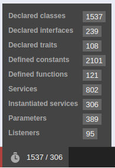

[](https://github.com/steevanb/dev-bundle/tree/4.1.0)
[](https://symfony.com/)


[](https://insight.sensiolabs.com/projects/16b18376-e47e-4a0c-8a47-c0eead976317/analyses/45)
[](https://scrutinizer-ci.com/g/steevanb/dev-bundle/?branch=master)

### dev-bundle

Bundle for dev environment, to help you find missing translations, validate your Doctrine schema automatically and show what is loaded (classes, services etc).

[Changelog](changelog.md)

### Installation

```bash
composer require steevanb/dev-bundle ^4.1
```

Or add it manually, and then execute _composer update steevanb/dev-bundle_ :

```json
# composer.json
{
    "require": {
        "steevanb/dev-bundle": "^4.1"
    }
}
```

Add bundle to your AppKernel :

```php
# app/AppKernel.php
class AppKernel extends Kernel
{
    public function registerBundles()
    {
        if ($this->getEnvironment() == 'dev') {
            $bundles[] = new steevanb\DevBundle\DevBundle();
        }
    }
}
```

### Configuration

```yml
# app/config/config.yml
dev:
    # throws steevanb\DevBundle\Exception\TranslationsNotFoundException on translations not found
    translation_not_found:
        enabled: [TRUE|false]
        # allow Translator to search your translation in fallbacks, or not
        allow_fallbacks: [true|FALSE]
    # validate Doctrine schema
    validate_schema:
        enabled: [TRUE|false]
        disabled_urls:
            - /_wdt
            - /_profiler/
            - /_errors
        event: [KERNEL.REQUEST|kernel.response]
        excludes:
            - Foo\Bar\Entity
            - Foo\Bar\Entity#property
        bundles:
            # enable scan of Resources/config/doctrine dir of bundles
            enabled: [TRUE|false]
            # bundles to scan. if empty or not specified, will add all installed bundles
            bundles:
                - FooBundle
                - BarBundle
```

### Translation not found exception

Throws steevanb\Exception\TranslationsNotFoundException at _kernel.response_ event when at least one translation is not found.

All translations not found throws this exception, especially when fallbacks are used.

For example, if you have a _messages.fr.yml_ in your bundle, and you try to translate a string with _fr_FR_ locale,
exception will be throwned. You can allow this with _translation.allow_fallbacks_ configuration.

### Validate Doctrine mapping

Same as calling _doctrine:schema:validate_ on each request, with a cache to not recall it if nothing has changed.

Throws steevanb\Exception\InvalidMappingException when mapping informations are invalid.

Doctrine schema validation will be executed on each request (_kernel.request_ or _kernel.response event_, depends on configuration), only for main request.

You can exclude entities or properties validation, by adding values in _dev.validate_schema.excludes_ configuration.

If value is a fully classified entity, all validation errors on this entity will be ignored.

If value if a fully qualifier entity, plus a property (ex : _Foo\Bar\Entity#property_),
only validation errors on this property will be ignored.

### List loaded classes, services etc

Add Symfony WebProfilter panel, with informations about what is loaded : classes, traits, interfaces, services, container parameters, etc.


